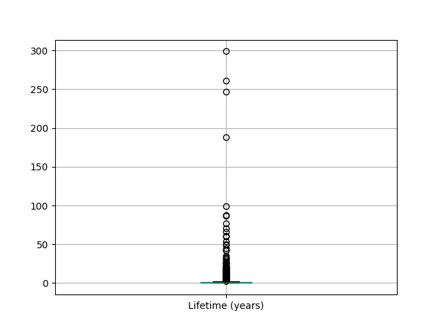

# Volcano Data Procssing

### Set-up instructions

Enter the flask_project directory with:
```
cd "Volcano_Data_Cleaning"
```
No other set-up instructions needed other than installing from requirements.txt (eg. pandas, matlplotlib).

## Introduction

The purpose of this work is to process a data set to be used in a web application about natural disasters; he web application will be implemented as a group project (which will introduce other data sets). This markdown file shows how the data was processed to be then used in collaboration with other people.

## Definition of the business need
### Problem definition

Volcanic eruptions are a significant natural distaster which can result in the destruction of populated areas and deaths of the residing people. However, land near volcanoes is very rich in minerals and many farmers choose to live near them. 

The volcanic data set is very large and is difficult to extract data from. I am interested in designing a tool which will allow the user to see behavioural trends of volcanic eruptions. This would allow farmers to decide where to grow their plots and if the location is safe for the coming years.

##### Sugested web app
I intend to design an interactive information page which allows the user to either display the information on a map or table. The information displayed will be controlled by filters which could show volcanic events based on eruption intensity(VEI), years of occurance, and location. A slider could be used to change the years and display the chosen range on the map. Such a tool could help a farmer decide if the area is safe based on previous volcanic trends. They could also see the locations of volcanoes around them, and how powerful their VEI has been. This will allow the farmer to choose a mineral rich area for their farm whilst also being safe from eruptions.

### Target audience
Farmers:
The broader target audience for this project are farmers. In the development process, farmers who wish to use such an app will be reached out to and will be allowed to test the page. They will then be asked for feedback.

Specific farmer persona:


### Questions to be answered using the dataset
Where do volcanoes occur?

Do volcanoes cause other near by volcanoes to start errupting?

How long do volcanoes last for?

Were historic volcano data points recorded more in specific areas of the world?

## Data preparation and exploration
### Data preparation

[Data Preparation](data_preparation.py)

### Prepared data set
[Original data set](VolcanoData.csv)

[Prepared data set](clean_volcano_data.csv)

When preparing the data I first glanced through the excel file data set to get a general idea of the data and then made a mental note of the columns I knew would be relevant (eg coordinates). I then looked at the counts of unique data types in the columns I thought were not needed.
Upon looking at the data types in the terminal i decided that:

- Columns with "modifier" headings would not be useful: delete
- Columns with "uncertainty" will not be needed in the final presentation:delete
- VEI column starts with many Nans but provide information about explosivity for most of the volcanoes: replace Nan values with "VEI unknown"
- Eruption category provides relevant information about the accuracy of the data: keep column
- Evidence  Method (dating) provides relevant historical information: keep column
- Start Month had a few 0s. This is impossible. Dates will be delt with next.

It is impossible for months and days to begin with 0 so they were replaced with 1. 

Next, the number of Nans were explored for each column:
- Area of activity column had many Nans: it would be deleted as to keep the presented data consistent, and because the coordiantes provide enough location information.
- VEI has some Nans but will be kept because data is relevant.

Other data to be deleted:
Eruption number and Volcano number will not be relevant in the final presentation of data.

Columns deleted: 'VEI Modifier', 'Start Year Modifier', 'Start Year Uncertainty','Start Day Modifier', 'Start Day Uncertainty', 'End Year Modifier','End Year Uncertainty','End Day Modifier', 'End Day Uncertainty', 'Volcano Number', 'Eruption Number', 'Area of Activity'

Rows which have no start year were deleted as this information irrelevant (only 2 counts). I will be keeping data rows which have no end date because only the start of many historical volcanoes was noted and this is relevant information.

Columns which have more than half of the data missing are now also deleted.

Next, a part of the data exploration had to be performed at this stage because working with columns where Nans have been replaced with strings would be difficult:
A new column called Lifetime (years) was created and shows the years between start-end of the volcano.

I also thought that it may be useful to have a column which shows the date in a conventional way (D/M/Y). For this, a function (Format Nans) was created: the dates had to be converted into integers (as to remove the decimal "x.oo") and then concatanated into a single column. However, there were Nans present. To avoid errors, the Nans had to first be converted to 0 and then be converted into some unknown values after the date concatanation was performed.
The day/month/year start/end columns will stil be kept becuase it is easier to perform mathematical operations on them. I would have wanted to use the function to_datetime() but it does not support the use of dates under 1677.

All the null date values have been replaced to "unknowns" and now only VEI and Evidence Method (dating) have nans. They will now too be replaced with "unknown".

The final remaining columns with formatted data are:
-Volcano Name
-Eruption Category
-VEI
-Start Year
-Start Month
-Start Day
-Evidence Method (dating)
-End Year
-End Month
-End Day
-Latitude
-Longitude
-Lifetime (years)
-Start date
-End date

The data is now prepared for exploring and is saved to 'clean_volcano_data"

### Data exploration

[Data Exploration](data_exploration.py)

[Prepared Data After Exploration](clean_explored_data.csv)

The data was first explored by plotting a histogram over all the years.


From the plot one can observe that there is far more data in the past 1000 years.
It may be  interesting for the user to seperate the data into modern eruption and older eruptions.

Next, plotting volcanoes over the past 2021 years:


From the finer plot it is clear that more data is available for the past 300 years.

After this I plotted a scatter plot of the longitude and latitude of the volcano eruptions


This plot can be compared to a pre existing plot of volcanoes on a map and one can observe that the positions are similar and the plot is correct.


[1] Volcano Map

Next, the lifetime of volcanoes is checked for outliers:



Longest lifetime is 299 years; some volcanoes can be active for hundreds of years: 299 is not an outlier

Lifetime Nan values can be now replaced with "Lifetime (years) Unknown".

The new cleaned data set is now saved to 'clean_explored_data.csv'.

## Selection of project methodology
### Methodology (or combination) selected

The Scrum method is suitable for this project because of its team orientated model. All team members should have a similar level knowledge and there are no specialists in specific areas. This applies to a university class because most people have similar levels of understanding. Small teams with one leader (scrum master) allow good group communication via the daily scrums. Sprints are useful as to ensure there are clear goals set for short periods of time (one month or less). Sprint reviews ensure the stakeholders are kept informed of the progress made and project transparency is maintained. This method is based around software development.

CRISP-DM provides an appropriate general frame to this project with the main phases: Business Understanding, Data Underestanding, Data Prepearation, Modelling, Evaluation and Deployment. The project will follow these general data science project steps. Based on the operation of the team, CRISP-DM can be agile and allows the team to go back to previous parts of the project

Combination of CRISP-DM and Scrum may be the best choice for this project. The Scrum method is able to provide a good team structure with  inter-team and team-client communication. Project sprints ensure that the team has clear goals and the reviews let the client see the progress(transparency). CRISP-DM compliments this by letting the team be agile in the work process and go back to refine previous parts of the project, whilst also providing a good work frame for a data science based project. Since this project revolves around data science and software development, using a combination of both methods will be very useful.

### Selection criteria and justification of selection

Methodology should require a low level knowledge as most of the team members will have limited experience with the use of software engineering and data science process models.

Team communication is crucial as to ensure everybody is on top of their work.

Transparency with the client is important so that work progress is visible and the client can easily comment on changes they want to see.

Project requirement volatility may be high if the client decides they want to see changes.
